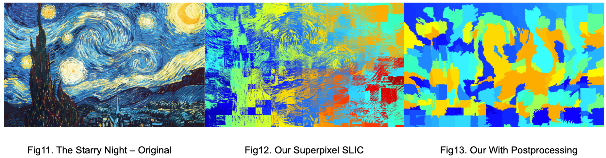
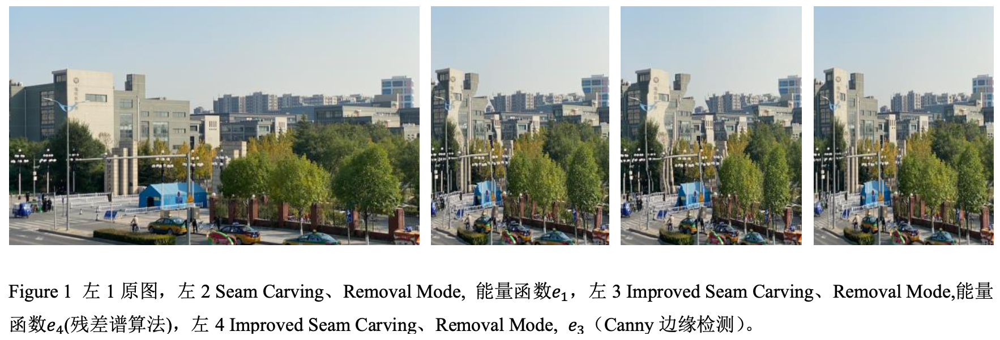

# BIT_CS_2021_Digital_Image_Process_Demo
 Beijing Institute of Technology, 2021, Digital Image Process, including Seam Carving Demo & Superpixel SLIC Demo

The Project uses OpenCV 4, experiment reports are included. Read these reports (in Chinese) for further details.

## Superpixel SLIC Demo:

A direct implement of Superpixel SLIC, similar to OpenCV's implementation when using.

## Seam Carving Demo:

Seam Carving for image resize, combined with Canny edge detection & saliency map calculation, using improved energy function.
